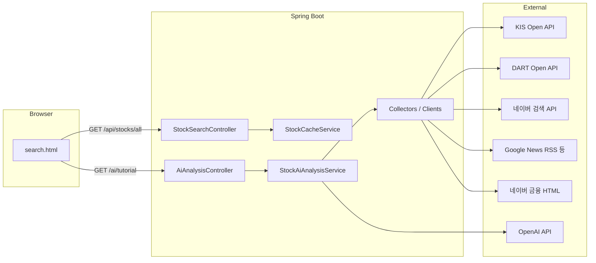

# AIS 설계 문서 (DESIGN)

## 1. 목표와 범위

### 목표

사용자가 **6자리 단축 종목코드**로 종목을 고르면, 서버가 여러 출처의 정보를 모아 **한 번의 자연어 응답**으로 “지금 이 종목 분위기와 배경”을 초보자도 이해하기 쉽게 정리한다.

### 범위

- **백엔드 단일 모듈** (Spring Boot). 별도 프론트엔드 빌드 파이프라인 없음.
- **정적 HTML 한 장**(`static/search.html`) + `fetch` 로 API 호출.
- **투자 판단·수익 보장·법적 해석**은 범위 밖이며, LLM 출력은 **설명용**으로만 취급한다.

---

## 2. 상위 구조

---

## 3. 패키지 구조 (개념)

| 영역 | 역할 |
|------|------|
| `com.example.demo` | 부트스트랩, `@ConfigurationPropertiesScan`, 스케줄링 활성화 |
| `config` | 공통 Bean (예: `RestTemplate`) |
| `stock.search` | KOSPI/KOSDAQ 마스터 기반 종목 목록 캐시, 검색 API |
| `collect.dart` | DART API 클라이언트·DTO·설정 |
| `collect.kis` | 한국투자증권 토큰·시세 API |
| `collect.news` | 네이버 뉴스 API, 구글 뉴스(RSS 등) |
| `collect.naverboard` | 네이버 금융 **종목토론 목록** HTML 파싱 (비공식) |
| `ai.openai` | OpenAI 호출, 튜토리얼용 프롬프트 조립 |
| `ai.controller` | `/ai/tutorial` REST |

---

## 4. 핵심 데이터 흐름: AI 튜토리얼

`StockAiAnalysisService.generateWhyApproachTutorial(...)` 가 단일 오케스트레이션 역할을 한다.

1. **시세 (KIS)**  
   - 단축코드(6자리)로 현재가·등락·거래량 등 텍스트 요약.

2. **공시·재무 (DART)**  
   - `DartCorpCodeManager` 등으로 **6자리 → 8자리 DART 코드** 매핑 후 공시·재무·원문 ZIP(가능 시) 처리.

3. **뉴스**  
   - 네이버 검색 API, 구글 뉴스 등으로 키워드 기반 헤드라인·요약 수집.

4. **커뮤니티 (네이버 종목토론)**  
   - `NaverStockBoardClient`가 목록 페이지 HTML에서 **최신 N개** 게시글 메타(제목, 추천/비추천 등) 추출.  
   - **추천·비추천 합**으로 거친 **긍·부정 힌트 문장**을 만든 뒤, LLM에 “참고용 여론”으로 전달.

5. **LLM**  
   - 시스템 프롬프트: 초보 대상 톤, 현재가 직접 노출 지양, **토론글은 개인 의견**임을 명시.  
   - 유저 프롬프트: 위 수집 문자열을 섹션별로 삽입 후 `OpenAiDirectClient`로 Chat Completions 요청.

응답은 **plain text** (`text/plain; charset=UTF-8`) 로 반환하고, 프론트는 줄바꿈을 ` ` 로 치환해 표시한다.

---

## 5. 종목 목록 캐시

`StockCacheService`는 KIS에서 제공하는 **마스터 ZIP** URL에서 종목 정보를 내려받아 파싱하고,  
`stock_list_cache.json` 및 메모리에 보관한다.  
`@Scheduled` 로 주기적 갱신(코드 기준 일일 스케줄)을 둘 수 있다.

`/api/stocks/all` 는 DB 없이 **메모리 리스트**를 그대로 JSON으로 내려준다.

---

## 6. 설정과 보안

- `application.properties`에는 **비밀이 없도록** `${ENV:}` 형태만 두고, 실제 값은 **`.env`** 또는 배포 환경 변수로 주입한다.
- `.env`는 Git에 올리지 않는다. 팀원은 `.env.example`을 복사해 사용한다.
- 외부 API 키가 유출되면 즉시 **폐기·재발급**한다.

---

## 7. 비공식 스크래핑에 대한 설계적 전제

- **네이버 금융 종목토론**은 DOM 구조(`table.type2`, `tr[onmouseover]` 등)에 의존한다. 마크업이 바뀌면 **클라이언트 수정**이 필요하다.
- 스크래핑은 **차단·약관 위반 가능성**이 있으므로, 장기적으로는 허용된 공식 데이터 소스로 대체하는 것이 안전하다.

---

## 8. 확장 포인트

- 감성 분석을 LLM만이 아니라 **별도 모델/룰**로 분리해 검증 가능한 출력 추가.
- 종목토론 **본문**까지 수집하려면 글 단위 URL 요청이 늘어나므로, 캐시·속도 제한·정책 검토가 필요하다.
- DTO·수집기 인터페이스(`ApiCollector` 등)를 활용해 **출처별 모듈 테스트**를 강화할 수 있다.

---

## 9. 참고 링크

- [Spring Boot Gradle Plugin](https://docs.spring.io/spring-boot/4.0.4/gradle-plugin)
- [Open DART API](https://opendart.fss.or.kr/)
- 프로젝트 시작용 템플릿: [HELP.md](./HELP.md)
