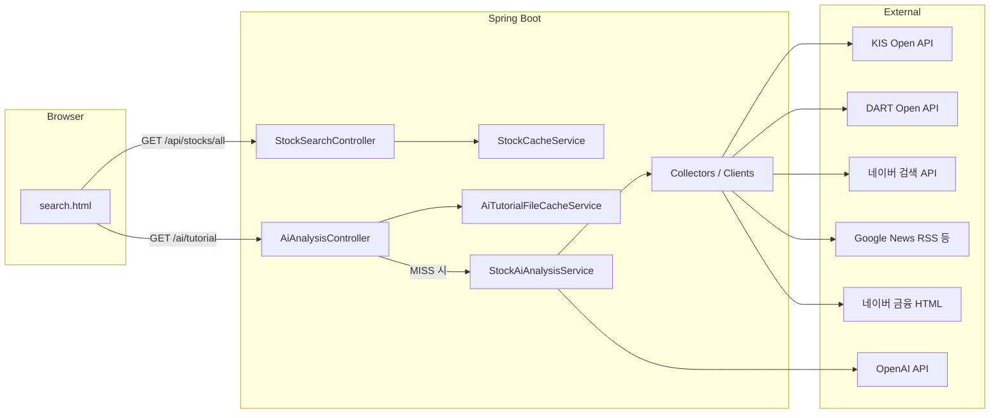

# AIS 설계 문서 (DESIGN)

## 1. 목표와 범위

### 목표

사용자가 **6자리 단축 종목코드**로 종목을 고르면, 서버가 여러 출처의 정보를 모아 **한 번의 자연어 응답**으로 “지금 이 종목 분위기와 배경”을 초보자도 이해하기 쉽게 정리한다.

### 범위

- **백엔드 단일 모듈** (Spring Boot). 별도 프론트엔드 빌드 파이프라인 없음.
- **정적 HTML 한 장**(`static/search.html`) + `fetch` 로 API 호출.
- **투자 판단·수익 보장·법적 해석**은 범위 밖이며, LLM 출력은 **설명용**으로만 취급한다.

---

## 2. 상위 구조

---

## 3. 패키지 구조 (개념)

| 영역 | 역할 |
|------|------|
| `com.example.demo` | 부트스트랩, `@ConfigurationPropertiesScan`, 스케줄링 활성화 |
| `config` | 공통 Bean (예: `RestTemplate`) |
| `stock.search` | KOSPI/KOSDAQ 마스터 기반 종목 목록 캐시, 검색 API |
| `collect.dart` | DART API 클라이언트·DTO·설정 |
| `collect.kis` | 한국투자증권 토큰·시세 API |
| `collect.news` | 네이버 뉴스 API, 구글 뉴스(RSS 등) |
| `collect.news.cache` | 시장 키워드 뉴스 **파일 캐시** (`MarketNewsFileCacheService`) |
| `collect.dart.cache` | DART API **일 단위 파일 캐시** (`DartDailyFileCacheService`) |
| `collect.naverboard` | 네이버 금융 **종목토론 목록** HTML 파싱 (비공식) |
| `collect.hanwha` | 한화 WM **기업·산업분석** 목록 1페이지 스크래핑 + 일 캐시 |
| `ai.openai` | OpenAI 호출, 튜토리얼용 프롬프트 조립 |
| `ai.cache` | 튜토리얼 응답 **파일 캐시** (`TutorialCacheFile`, `AiTutorialFileCacheService`) |
| `ai.controller` | `/ai/tutorial` REST |

---

## 4. 핵심 데이터 흐름: AI 튜토리얼

`AiAnalysisController`는 먼저 `AiTutorialFileCacheService.readIfValid(종목코드)`로 **디스크 캐시**를 조회한다.  
유효한 `TutorialCacheFile`이 있으면 그 안의 `AiTutorialResponse`만 반환하고(응답 헤더 `X-AIS-Tutorial-Cache: HIT`), 없거나 만료되었으면 `StockAiAnalysisService.generateWhyApproachTutorial(...)`를 호출한 뒤 `put`으로 파일을 갱신한다(`MISS`).

`StockAiAnalysisService.generateWhyApproachTutorial(...)` 가 단일 오케스트레이션 역할을 한다.

1. **시세·지표 (KIS)**  
   - `inquire-price` 등에서 **PER/PBR/EPS/BPS, 거래량·거래대금·회전, 외국인 소진율** 등을 활용한다.  
   - **LLM 입력 문자열**에서는 등락률·현재가·52주 대비(%)처럼 짧은 TTL 캐시와 어긋나기 쉬운 수치는 넣지 않고, **거래량 맥락·체결·밸류·RSI** 위주로 요약한다(`buildKisLlmContext` 등).  
   - `inquire-investment-indicator`(TR FHKST01010900): RSI(`rsiv_val`) 등.  
   - `inquire-ccnl`(TR FHKST01010300): 시간대별 체결·**당일 체결강도**(`tday_rltv`) 등.  
   - 위 값을 `KisMarketMetrics`로 묶어 LLM 입력과 `evidence`에 반영.

2. **공시·재무 (DART)**  
   - `DartCorpCodeManager` 등으로 **6자리 → 8자리 DART 코드** 매핑 후 공시·재무·원문 ZIP(가능 시) 처리.

3. **뉴스**  
   - 네이버 검색 API, 구글 뉴스 등으로 키워드 기반 헤드라인·요약 수집.

4. **커뮤니티 (네이버 종목토론)**  
   - `NaverStockBoardClient`가 목록 페이지 HTML에서 **최신 N개** 게시글 메타(제목, 추천/비추천 등) 추출.  
   - **추천·비추천 합**으로 거친 **긍·부정 힌트 문장**을 만든 뒤, LLM에 “참고용 여론”으로 전달.

5. **LLM**  
   - 시스템·유저 프롬프트: 초보 대상 톤, **등락률·현재가·몇 % 상승/하락·52주 대비 %** 표현 금지, **토론글은 개인 의견**임을 명시.  
   - 유저 프롬프트: 위 수집 문자열을 섹션별로 삽입 후 `OpenAiDirectClient`로 Chat Completions 요청.

`/ai/tutorial` 응답은 **JSON** (`AiTutorialResponse`)이며, `summary`(LLM 본문)와 `evidence`(참조한 시세 문구·DART 공시·뉴스·종목토론 메타 등)를 함께 반환한다. 프론트(`search.html`)는 요약을 표시하고, `
`로 근거 목록을 접었다 펼칠 수 있다. 캐시 HIT/MISS 안내는 응답 헤더와 짧은 문구로 표시한다.

---

## 4.1 AI 튜토리얼 파일 캐시 (운영)

| 항목 | 설명 |
|------|------|
| 위치 | 기본 `cache/tutorial/{6자리코드}.json` (`app.tutorial-cache.directory`) |
| 형식 | `TutorialCacheFile`: 버전, 메타, `createdAtMillis` / `expiresAtMillis`, 중첩 `AiTutorialResponse` |
| TTL | `app.tutorial-cache.ttl-minutes`(기본 10). 만료 후 다음 요청에서 재수집·덮어쓰기. |
| 쓰기 | 임시 파일에 직렬화 후 `Files.move`(원자 이동 미지원 시 copy+delete). |
| HTTP | `X-AIS-Tutorial-Cache`, `X-AIS-Tutorial-Cache-Generated`, `X-AIS-Tutorial-Cache-Expires`(ISO-8601). |
| Git | `*.json`은 `.gitignore`, 폴더 설명은 `cache/tutorial/README.md`만 추적. |

**운영 포인트**

- **수평 확장**: 로컬 디스크 캐시는 인스턴스마다 따로이므로, 트래픽이 여러 노드로 갈 경우 HIT율이 낮아질 수 있다. NFS 등 공유 볼륨 또는 Redis/캐시 게이트웨이 도입을 검토한다.  
- **동시 MISS**: 동일 종목에 대한 동시 첫 요청은 모두 MISS가 될 수 있다. 필요 시 분산 락·singleflight 패턴으로 OpenAI 호출을 한 번으로 묶는다.  
- **용량·정리**: 종목×파일 수가 늘어나므로 디스크 알람·만료 파일 배치 삭제·로그 로테이션과 함께 경로를 백업 정책에 명시한다.  
- **무효화**: 특정 종목만 재분석하려면 해당 JSON 파일을 삭제한다.

---

## 4.2 시장 뉴스 파일 캐시 (코스피 / 코스닥 공통)

| 항목 | 설명 |
|------|------|
| 목적 | 시장 키워드(예: `코스피 증시`, 구글 RSS `코스피`)는 **종목과 무관**하게 동일하므로, 튜토리얼 종목 캐시와 분리해 **시장 슬러그당 1파일**로 재사용한다. |
| 위치 | `cache/market-news/{KOSPI\|KOSDAQ\|…}.json` (`app.market-news-cache.directory`) |
| TTL | `app.market-news-cache.ttl-minutes`(기본 30). `app.market-news-cache.enabled=false` 시 매 요청 원본 API 호출. |
| 형식 | `MarketNewsCacheEnvelope`: 네이버 응답 DTO + `List<RssNewsItem>` |
| 문서 | [cache/market-news/README.md](./cache/market-news/README.md) |

---

## 4.3 DART 일 단위 파일 캐시

| 항목 | 설명 |
|------|------|
| 목적 | 공시 목록·재무·지분·주요사항·원문 ZIP은 **당일 KST 기준**으로 바뀔 빈도가 낮은 편이므로, 동일 일자·동일 키에 대해 **하루 1회 수준**으로 DART 호출을 줄인다. |
| 위치 | `cache/dart/daily/{yyyyMMdd}/` 하위에 JSON 및 `doc_{접수번호}.zip` (`app.dart-cache.directory`) |
| 키 | 8자리 `corp_code` + API 종류 + 조회 파라미터(날짜·페이지 등)를 파일명에 반영. |
| 설정 | `app.dart-cache.enabled` 로 끄고 원본만 호출할 수 있다. |
| 문서 | [cache/dart/daily/README.md](./cache/dart/daily/README.md) |
| 운영 | 일자 폴더가 쌓이므로 **보관 일수 제한 배치**를 두는 것이 좋다. |

---

## 5. 종목 목록 캐시

`StockCacheService`는 KIS에서 제공하는 **마스터 ZIP** URL에서 종목 정보를 내려받아 파싱하고,  
`stock_list_cache.json` 및 메모리에 보관한다.  
`@Scheduled` 로 주기적 갱신(코드 기준 일일 스케줄)을 둘 수 있다.

`/api/stocks/all` 는 DB 없이 **메모리 리스트**를 그대로 JSON으로 내려준다.

---

## 6. 설정과 보안

- `application.properties`에는 **비밀이 없도록** `${ENV:}` 형태만 두고, 실제 값은 **`.env`** 또는 배포 환경 변수로 주입한다.
- `.env`는 Git에 올리지 않는다. 팀원은 `.env.example`을 복사해 사용한다.
- 외부 API 키가 유출되면 즉시 **폐기·재발급**한다.

---

## 7. 비공식 스크래핑에 대한 설계적 전제

- **네이버 금융 종목토론**은 DOM 구조(`table.type2`, `tr[onmouseover]` 등)에 의존한다. 마크업이 바뀌면 **클라이언트 수정**이 필요하다.
- 스크래핑은 **차단·약관 위반 가능성**이 있으므로, 장기적으로는 허용된 공식 데이터 소스로 대체하는 것이 안전하다.

### 7.1 한화투자증권 WM 「기업·산업분석」 목록 스크래핑 검토

참고 URL: [한화 WM 투자정보 > 기업·산업분석](https://www.hanwhawm.com/main/research/main/list.cmd?depth2_id=1002&mode=depth2)

| 관점 | 평가 |
|------|------|
| **법·약관** | 리포트 제목·요약·본문은 **저작권·2차 저작물** 이슈가 크다. 약관상 자동 수집·재배포가 금지되거나 제한될 수 있어 **법무 검토 없이 MTS에 반영하지 않는 것**이 안전하다. |
| **기술** | 목록은 HTML·세션·봇 방어(캡차·레이트 리밋)에 의존할 수 있어, DOM 변경 시 **유지보수 비용이 네이버 종목토론과 동급 이상**으로 간주한다. |
| **대안** | 한화(또는 타사)와 **제휴·RSS·REST 피드**로 공식 제공받거나, **DART·뉴스·벤더(FnGuide 등)** 조합으로 리서치 맥락을 구성하는 편이 운영·컴플라이언스에 유리하다. |
| **결론** | 데모·내부 PoC 외 **상용 MTS 기본 경로로 스크래핑 도입은 비권장**. 반드시 도입 시 별도 **동의·계약·출처 표기·저장 주기** 정책을 둔다. |

**구현 상태(요청 반영)**: `HanwhaResearchListClient` + `HanwhaResearchDailyCacheService`로 목록 1페이지를 수집·`cache/hanwha-research/{날짜}.json`에 일 캐시하며, `TutorialEvidence.hanwhaResearch` 및 LLM 프롬프트에 포함한다. `app.hanwha-research.enabled=false`로 비활성화 가능.

---

## 8. 확장 포인트

- 감성 분석을 LLM만이 아니라 **별도 모델/룰**로 분리해 검증 가능한 출력 추가.
- 종목토론 **본문**까지 수집하려면 글 단위 URL 요청이 늘어나므로, 캐시·속도 제한·정책 검토가 필요하다.
- DTO·수집기 인터페이스(`ApiCollector` 등)를 활용해 **출처별 모듈 테스트**를 강화할 수 있다.

---

## 9. 소스 전반 유지보수 점검 (캐시·외부 연동)

- **캐시 경계**: 종목 튜토리얼(`cache/tutorial`) / 시장 뉴스(`cache/market-news`) / DART 일 캐시(`cache/dart/daily`)를 **역할별로 분리**해, TTL·무효화·용량 정책을 각 README와 `application.properties`에만 모아 둔다.  
- **플래그**: `app.dart-cache.enabled`, `app.market-news-cache.enabled`로 장애 시 외부만 우회할 수 있게 한다.  
- **스키마 버전**: 튜토리얼 응답 JSON은 `TutorialCacheFile.version`으로 구버전 파일을 HIT하지 않게 한다. 시장·DART 캐시도 필요 시 동일 패턴으로 확장한다.  
- **수집기 단일 책임**: `DartApiClient`는 HTTP만, 일 캐시는 `DartDailyFileCacheService`에 모아 **한 곳에서만** 디스크 정책을 바꾼다.  
- **향후**: 공시 ZIP 용량이 크면 **텍스트 스니펫만** 별도 캐시하거나, 오브젝트 스토리지로 이전하는 것이 디스크 I/O에 유리하다.

---

## 10. 참고 링크

- [Spring Boot Gradle Plugin](https://docs.spring.io/spring-boot/4.0.4/gradle-plugin)
- [Open DART API](https://opendart.fss.or.kr/)
- 프로젝트 시작용 템플릿: [HELP.md](./HELP.md)
